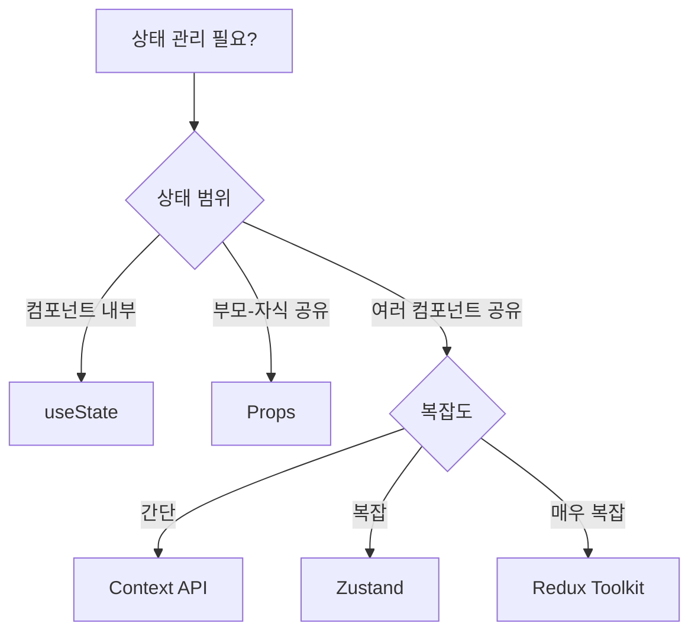

# Chapter 6: 상태 관리

## 📚 학습 목표
- Context API를 활용한 React 기본 상태 관리 이해
- Pinia와 유사한 Zustand로 전역 상태 관리하기
- 상태 관리 전략과 최적화 기법 습득
- Vue3 상태 관리 패턴을 React로 전환하기

---

## 1. Context API - React 기본 전역 상태 관리

### 이론 설명 (30%)

Context API는 React의 내장 전역 상태 관리 도구입니다. Vue3의 `provide/inject`와 유사하지만, 더 구조화된 방식으로 동작합니다.

#### Vue3 vs React 상태 관리 비교

| 특징 | Vue3 (Pinia) | React (Context API) | React (Zustand) |
|------|--------------|---------------------|-----------------|
| 설정 복잡도 | 중간 | 높음 | 낮음 |
| 보일러플레이트 | 적음 | 많음 | 매우 적음 |
| DevTools | Vue DevTools | React DevTools | Zustand DevTools |
| TypeScript 지원 | 우수 | 우수 | 우수 |
| 성능 최적화 | 자동 | 수동 (memo 필요) | 자동 |
| Provider 필요 | 필요 | 필요 | 불필요 |

### 실습 코드 (70%)

#### 1.1 Context API 기본 구조

```tsx
// React: Context API 기본 구조
// store/ThemeContext.tsx
import React, { createContext, useContext, useState, useCallback, ReactNode } from 'react'

// 1. Context 타입 정의
interface ThemeContextType {
  // 상태
  isDark: boolean
  primaryColor: string
  fontSize: 'small' | 'medium' | 'large'
  
  // 액션
  toggleTheme: () => void
  setPrimaryColor: (color: string) => void
  setFontSize: (size: 'small' | 'medium' | 'large') => void
  resetTheme: () => void
}

// 2. Context 생성 (Vue3의 provide key와 유사)
const ThemeContext = createContext<ThemeContextType | undefined>(undefined)

// 3. Provider 컴포넌트 (Vue3의 provide와 유사)
export function ThemeProvider({ children }: { children: ReactNode }) {
  // 상태 정의 (Vue3의 ref/reactive와 유사)
  const [isDark, setIsDark] = useState(false)
  const [primaryColor, setPrimaryColor] = useState('#1976d2')
  const [fontSize, setFontSize] = useState<'small' | 'medium' | 'large'>('medium')
  
  // 액션 정의 (Vue3의 composable 함수와 유사)
  const toggleTheme = useCallback(() => {
    setIsDark(prev => !prev)
  }, [])
  
  const resetTheme = useCallback(() => {
    setIsDark(false)
    setPrimaryColor('#1976d2')
    setFontSize('medium')
  }, [])
  
  // Context value 생성
  const value = {
    // 상태
    isDark,
    primaryColor,
    fontSize,
    // 액션
    toggleTheme,
    setPrimaryColor,
    setFontSize,
    resetTheme
  }
  
  return (
    <ThemeContext.Provider value={value}>
      {children}
    </ThemeContext.Provider>
  )
}

// 4. Custom Hook (Vue3의 inject와 유사)
export function useTheme() {
  const context = useContext(ThemeContext)
  
  // Context가 Provider 밖에서 사용되는 것 방지
  if (context === undefined) {
    throw new Error('useTheme must be used within ThemeProvider')
  }
  
  return context
}
```

```vue
<!-- Vue3 Pinia 비교: store/theme.ts -->
<script>
import { defineStore } from 'pinia'

export const useThemeStore = defineStore('theme', () => {
  // 상태
  const isDark = ref(false)
  const primaryColor = ref('#1976d2')
  const fontSize = ref<'small' | 'medium' | 'large'>('medium')
  
  // 액션
  const toggleTheme = () => {
    isDark.value = !isDark.value
  }
  
  const resetTheme = () => {
    isDark.value = false
    primaryColor.value = '#1976d2'
    fontSize.value = 'medium'
  }
  
  return {
    // 상태
    isDark,
    primaryColor,
    fontSize,
    // 액션
    toggleTheme,
    setPrimaryColor: (color: string) => primaryColor.value = color,
    setFontSize: (size: 'small' | 'medium' | 'large') => fontSize.value = size,
    resetTheme
  }
})
</script>
```

#### 1.2 Context API 실제 사용 예제

```tsx
// React: Context API 사용 - App.tsx
import React from 'react'
import { ThemeProvider, useTheme } from './store/ThemeContext'
import {
  Box,
  Container,
  Paper,
  Typography,
  Switch,
  FormControlLabel,
  Button,
  Select,
  MenuItem,
  FormControl,
  InputLabel,
  AppBar,
  Toolbar,
  Grid
} from '@mui/material'
import { createTheme, ThemeProvider as MuiThemeProvider } from '@mui/material/styles'

// Header 컴포넌트
function Header() {
  const { isDark, toggleTheme, primaryColor } = useTheme()
  
  return (
    <AppBar 
      position="static" 
      sx={{ 
        bgcolor: isDark ? 'grey.900' : primaryColor,
        mb: 3 
      }}
    >
      <Toolbar>
        <Typography variant="h6" sx={{ flexGrow: 1 }}>
          Context API 예제
        </Typography>
        <FormControlLabel
          control={
            <Switch 
              checked={isDark} 
              onChange={toggleTheme}
              color="default"
            />
          }
          label="다크 모드"
        />
      </Toolbar>
    </AppBar>
  )
}

// Settings 컴포넌트
function Settings() {
  const { 
    primaryColor, 
    setPrimaryColor, 
    fontSize, 
    setFontSize,
    resetTheme 
  } = useTheme()
  
  const colors = [
    { label: 'Blue', value: '#1976d2' },
    { label: 'Green', value: '#4caf50' },
    { label: 'Purple', value: '#9c27b0' },
    { label: 'Orange', value: '#ff9800' }
  ]
  
  return (
    <Paper sx={{ p: 3 }}>
      <Typography variant="h6" gutterBottom>
        테마 설정
      </Typography>
      
      <Grid container spacing={3}>
        <Grid item xs={12} sm={6}>
          <FormControl fullWidth>
            <InputLabel>주 색상</InputLabel>
            <Select
              value={primaryColor}
              onChange={(e) => setPrimaryColor(e.target.value)}
              label="주 색상"
            >
              {colors.map(color => (
                <MenuItem key={color.value} value={color.value}>
                  <Box sx={{ display: 'flex', alignItems: 'center', gap: 1 }}>
                    <Box 
                      sx={{ 
                        width: 20, 
                        height: 20, 
                        bgcolor: color.value,
                        borderRadius: 1
                      }} 
                    />
                    {color.label}
                  </Box>
                </MenuItem>
              ))}
            </Select>
          </FormControl>
        </Grid>
        
        <Grid item xs={12} sm={6}>
          <FormControl fullWidth>
            <InputLabel>글자 크기</InputLabel>
            <Select
              value={fontSize}
              onChange={(e) => setFontSize(e.target.value as any)}
              label="글자 크기"
            >
              <MenuItem value="small">작게</MenuItem>
              <MenuItem value="medium">보통</MenuItem>
              <MenuItem value="large">크게</MenuItem>
            </Select>
          </FormControl>
        </Grid>
        
        <Grid item xs={12}>
          <Button 
            variant="outlined" 
            color="secondary"
            onClick={resetTheme}
          >
            초기화
          </Button>
        </Grid>
      </Grid>
    </Paper>
  )
}

// Content 컴포넌트
function Content() {
  const { isDark, fontSize } = useTheme()
  
  const getFontSize = () => {
    switch(fontSize) {
      case 'small': return '0.875rem'
      case 'large': return '1.25rem'
      default: return '1rem'
    }
  }
  
  return (
    <Paper 
      sx={{ 
        p: 3, 
        mt: 3,
        bgcolor: isDark ? 'grey.800' : 'background.paper',
        color: isDark ? 'white' : 'text.primary'
      }}
    >
      <Typography 
        variant="h6" 
        gutterBottom
        sx={{ fontSize: getFontSize() }}
      >
        컨텐츠 영역
      </Typography>
      <Typography sx={{ fontSize: getFontSize() }}>
        Context API를 통해 전역 상태를 관리하고 있습니다.
        테마 설정을 변경하면 모든 컴포넌트에 즉시 반영됩니다.
      </Typography>
    </Paper>
  )
}

// Main App
function App() {
  return (
    <ThemeProvider>
      <Box sx={{ minHeight: '100vh' }}>
        <Header />
        <Container>
          <Settings />
          <Content />
        </Container>
      </Box>
    </ThemeProvider>
  )
}

export default App
```

#### 1.3 Context API 최적화

```tsx
// React: Context 성능 최적화
import React, { 
  createContext, 
  useContext, 
  useState, 
  useCallback,
  useMemo,
  memo,
  ReactNode 
} from 'react'

// 🔴 문제: Context 값이 변경되면 모든 Consumer가 리렌더링
// 해결책: Context 분리 + memo + useMemo

// 1. Context 분리 패턴
// 상태와 액션을 별도 Context로 분리
interface UserState {
  user: { id: string; name: string } | null
  isLoading: boolean
}

interface UserActions {
  login: (email: string, password: string) => Promise<void>
  logout: () => void
  updateProfile: (name: string) => void
}

const UserStateContext = createContext<UserState | undefined>(undefined)
const UserActionsContext = createContext<UserActions | undefined>(undefined)

export function UserProvider({ children }: { children: ReactNode }) {
  const [user, setUser] = useState<{ id: string; name: string } | null>(null)
  const [isLoading, setIsLoading] = useState(false)
  
  // 액션은 useCallback으로 메모이제이션
  const login = useCallback(async (email: string, password: string) => {
    setIsLoading(true)
    try {
      // API 호출 시뮬레이션
      await new Promise(resolve => setTimeout(resolve, 1000))
      setUser({ id: '1', name: '홍길동' })
    } finally {
      setIsLoading(false)
    }
  }, [])
  
  const logout = useCallback(() => {
    setUser(null)
  }, [])
  
  const updateProfile = useCallback((name: string) => {
    setUser(prev => prev ? { ...prev, name } : null)
  }, [])
  
  // 상태와 액션을 useMemo로 메모이제이션
  const stateValue = useMemo(() => ({
    user,
    isLoading
  }), [user, isLoading])
  
  const actionsValue = useMemo(() => ({
    login,
    logout,
    updateProfile
  }), [login, logout, updateProfile])
  
  return (
    <UserStateContext.Provider value={stateValue}>
      <UserActionsContext.Provider value={actionsValue}>
        {children}
      </UserActionsContext.Provider>
    </UserStateContext.Provider>
  )
}

// Hook 분리
export function useUserState() {
  const context = useContext(UserStateContext)
  if (!context) throw new Error('UserStateContext not found')
  return context
}

export function useUserActions() {
  const context = useContext(UserActionsContext)
  if (!context) throw new Error('UserActionsContext not found')
  return context
}

// 2. memo를 활용한 컴포넌트 최적화
const UserInfo = memo(function UserInfo() {
  // 상태만 구독 (액션 변경 시 리렌더링 안 함)
  const { user } = useUserState()
  
  console.log('UserInfo rendered')
  
  return (
    <div>
      {user ? `안녕하세요, ${user.name}님!` : '로그인해주세요'}
    </div>
  )
})

const LoginButton = memo(function LoginButton() {
  // 액션만 구독 (상태 변경 시 리렌더링 안 함)
  const { login } = useUserActions()
  
  console.log('LoginButton rendered')
  
  return (
    <button onClick={() => login('test@test.com', '1234')}>
      로그인
    </button>
  )
})
```

---

## 2. Zustand - Pinia와 유사한 상태 관리

### 이론 설명

Zustand는 Pinia와 매우 유사한 경량 상태 관리 라이브러리입니다. Provider 없이 사용할 수 있고, 보일러플레이트가 적어 Vue3 개발자들이 쉽게 적응할 수 있습니다.

#### Pinia vs Zustand 비교

| 특징 | Pinia | Zustand |
|------|-------|---------|
| Store 생성 | `defineStore()` | `create()` |
| 상태 접근 | `store.state` | `store((state) => state)` |
| 액션 호출 | `store.action()` | `store.getState().action()` |
| Computed | `getters` | selector 함수 |
| DevTools | 자동 | 수동 설정 |
| Provider | 필요 | 불필요 |

### 실습 코드

#### 2.1 Zustand 기본 사용법

```bash
# Zustand 설치
npm install zustand
npm install -D @types/zustand
```

```tsx
// React: Zustand Store - store/useAuthStore.ts
import { create } from 'zustand'
import { devtools, persist } from 'zustand/middleware'
import { immer } from 'zustand/middleware/immer'

// Store 타입 정의
interface User {
  id: string
  name: string
  email: string
  role: 'admin' | 'user' | 'guest'
}

interface AuthState {
  // 상태 (Pinia의 state와 동일)
  user: User | null
  token: string | null
  isLoading: boolean
  error: string | null
  
  // 액션 (Pinia의 actions와 동일)
  login: (email: string, password: string) => Promise<void>
  logout: () => void
  updateProfile: (data: Partial<User>) => void
  clearError: () => void
  
  // Computed (Pinia의 getters와 유사)
  get isAuthenticated(): boolean
  get isAdmin(): boolean
}

// Zustand Store 생성 (Pinia의 defineStore와 유사)
const useAuthStore = create<AuthState>()(
  devtools(  // DevTools 지원
    persist(  // localStorage 영속성
      immer(  // 불변성 자동 처리
        (set, get) => ({
          // 📌 상태 초기값
          user: null,
          token: null,
          isLoading: false,
          error: null,
          
          // 📌 액션들
          login: async (email: string, password: string) => {
            set(state => {
              state.isLoading = true
              state.error = null
            })
            
            try {
              // API 호출 시뮬레이션
              await new Promise(resolve => setTimeout(resolve, 1000))
              
              // 성공 시 상태 업데이트
              set(state => {
                state.user = {
                  id: '1',
                  name: '홍길동',
                  email,
                  role: 'admin'
                }
                state.token = 'fake-jwt-token'
                state.isLoading = false
              })
            } catch (error) {
              set(state => {
                state.error = '로그인 실패'
                state.isLoading = false
              })
            }
          },
          
          logout: () => {
            set(state => {
              state.user = null
              state.token = null
            })
          },
          
          updateProfile: (data: Partial<User>) => {
            set(state => {
              if (state.user) {
                // immer 덕분에 직접 수정 가능
                Object.assign(state.user, data)
              }
            })
          },
          
          clearError: () => {
            set(state => {
              state.error = null
            })
          },
          
          // 📌 Computed (getters)
          get isAuthenticated() {
            return !!get().user
          },
          
          get isAdmin() {
            return get().user?.role === 'admin'
          }
        })
      ),
      {
        name: 'auth-storage',  // localStorage 키
        partialize: (state) => ({  // 저장할 필드 선택
          user: state.user,
          token: state.token
        })
      }
    ),
    {
      name: 'AuthStore'  // DevTools에 표시될 이름
    }
  )
)

export default useAuthStore
```

```vue
<!-- Vue3 Pinia 비교: store/auth.ts -->
<script>
import { defineStore } from 'pinia'

export const useAuthStore = defineStore('auth', () => {
  // 상태
  const user = ref<User | null>(null)
  const token = ref<string | null>(null)
  const isLoading = ref(false)
  const error = ref<string | null>(null)
  
  // Computed
  const isAuthenticated = computed(() => !!user.value)
  const isAdmin = computed(() => user.value?.role === 'admin')
  
  // 액션
  async function login(email: string, password: string) {
    isLoading.value = true
    error.value = null
    
    try {
      await new Promise(resolve => setTimeout(resolve, 1000))
      user.value = {
        id: '1',
        name: '홍길동',
        email,
        role: 'admin'
      }
      token.value = 'fake-jwt-token'
    } catch (e) {
      error.value = '로그인 실패'
    } finally {
      isLoading.value = false
    }
  }
  
  function logout() {
    user.value = null
    token.value = null
  }
  
  function updateProfile(data: Partial<User>) {
    if (user.value) {
      user.value = { ...user.value, ...data }
    }
  }
  
  return {
    // 상태
    user,
    token,
    isLoading,
    error,
    // Computed
    isAuthenticated,
    isAdmin,
    // 액션
    login,
    logout,
    updateProfile,
    clearError: () => error.value = null
  }
}, {
  persist: true  // 영속성
})
</script>
```

#### 2.2 Zustand Store 사용하기

```tsx
// React: Zustand 사용 예제
import React, { useState } from 'react'
import useAuthStore from './store/useAuthStore'
import {
  Container,
  Paper,
  TextField,
  Button,
  Box,
  Typography,
  Alert,
  CircularProgress,
  Card,
  CardContent,
  Chip,
  Avatar,
  List,
  ListItem,
  ListItemIcon,
  ListItemText,
  Divider
} from '@mui/material'
import {
  Person as PersonIcon,
  Email as EmailIcon,
  Security as SecurityIcon,
  Logout as LogoutIcon
} from '@mui/icons-material'

// 로그인 컴포넌트
function LoginForm() {
  const [email, setEmail] = useState('test@example.com')
  const [password, setPassword] = useState('password')
  
  // Zustand store 사용 (Pinia와 유사)
  const { login, isLoading, error, clearError } = useAuthStore()
  
  const handleSubmit = async (e: React.FormEvent) => {
    e.preventDefault()
    await login(email, password)
  }
  
  return (
    <Paper sx={{ p: 3, maxWidth: 400, mx: 'auto' }}>
      <Typography variant="h5" gutterBottom>
        로그인
      </Typography>
      
      {error && (
        <Alert 
          severity="error" 
          onClose={clearError}
          sx={{ mb: 2 }}
        >
          {error}
        </Alert>
      )}
      
      <Box component="form" onSubmit={handleSubmit}>
        <TextField
          fullWidth
          label="이메일"
          type="email"
          value={email}
          onChange={(e) => setEmail(e.target.value)}
          margin="normal"
          required
          disabled={isLoading}
        />
        
        <TextField
          fullWidth
          label="비밀번호"
          type="password"
          value={password}
          onChange={(e) => setPassword(e.target.value)}
          margin="normal"
          required
          disabled={isLoading}
        />
        
        <Button
          type="submit"
          fullWidth
          variant="contained"
          sx={{ mt: 2 }}
          disabled={isLoading}
        >
          {isLoading ? <CircularProgress size={24} /> : '로그인'}
        </Button>
      </Box>
    </Paper>
  )
}

// 프로필 컴포넌트
function Profile() {
  const { user, isAdmin, logout, updateProfile } = useAuthStore()
  const [isEditing, setIsEditing] = useState(false)
  const [newName, setNewName] = useState(user?.name || '')
  
  if (!user) return null
  
  const handleUpdate = () => {
    updateProfile({ name: newName })
    setIsEditing(false)
  }
  
  return (
    <Card sx={{ maxWidth: 600, mx: 'auto' }}>
      <CardContent>
        <Box sx={{ display: 'flex', alignItems: 'center', mb: 3 }}>
          <Avatar sx={{ width: 56, height: 56, mr: 2 }}>
            {user.name[0]}
          </Avatar>
          <Box sx={{ flexGrow: 1 }}>
            {isEditing ? (
              <Box sx={{ display: 'flex', gap: 1 }}>
                <TextField
                  size="small"
                  value={newName}
                  onChange={(e) => setNewName(e.target.value)}
                />
                <Button size="small" onClick={handleUpdate}>
                  저장
                </Button>
                <Button 
                  size="small" 
                  onClick={() => setIsEditing(false)}
                >
                  취소
                </Button>
              </Box>
            ) : (
              <>
                <Typography variant="h6">
                  {user.name}
                  <Button 
                    size="small" 
                    onClick={() => setIsEditing(true)}
                    sx={{ ml: 1 }}
                  >
                    편집
                  </Button>
                </Typography>
                <Chip 
                  label={isAdmin ? '관리자' : '사용자'} 
                  color={isAdmin ? 'error' : 'default'}
                  size="small"
                />
              </>
            )}
          </Box>
        </Box>
        
        <List>
          <ListItem>
            <ListItemIcon>
              <PersonIcon />
            </ListItemIcon>
            <ListItemText 
              primary="ID"
              secondary={user.id}
            />
          </ListItem>
          
          <ListItem>
            <ListItemIcon>
              <EmailIcon />
            </ListItemIcon>
            <ListItemText 
              primary="이메일"
              secondary={user.email}
            />
          </ListItem>
          
          <ListItem>
            <ListItemIcon>
              <SecurityIcon />
            </ListItemIcon>
            <ListItemText 
              primary="권한"
              secondary={user.role}
            />
          </ListItem>
        </List>
        
        <Divider sx={{ my: 2 }} />
        
        <Button
          fullWidth
          variant="outlined"
          color="error"
          startIcon={<LogoutIcon />}
          onClick={logout}
        >
          로그아웃
        </Button>
      </CardContent>
    </Card>
  )
}

// 메인 앱
function App() {
  // Zustand store의 특정 값만 구독
  const isAuthenticated = useAuthStore(state => state.isAuthenticated)
  
  return (
    <Container sx={{ py: 4 }}>
      <Typography variant="h4" align="center" gutterBottom>
        Zustand 상태 관리
      </Typography>
      
      {isAuthenticated ? <Profile /> : <LoginForm />}
    </Container>
  )
}

export default App
```

#### 2.3 복잡한 Zustand Store 예제

```tsx
// React: 복잡한 Zustand Store - store/useCartStore.ts
import { create } from 'zustand'
import { devtools, subscribeWithSelector } from 'zustand/middleware'
import { immer } from 'zustand/middleware/immer'

interface Product {
  id: string
  name: string
  price: number
  image: string
  stock: number
}

interface CartItem extends Product {
  quantity: number
}

interface CartState {
  // 상태
  items: CartItem[]
  isOpen: boolean
  coupon: string | null
  discount: number
  
  // 액션
  addItem: (product: Product, quantity?: number) => void
  removeItem: (productId: string) => void
  updateQuantity: (productId: string, quantity: number) => void
  clearCart: () => void
  toggleCart: () => void
  applyCoupon: (code: string) => void
  
  // Computed (selector로 사용)
  getTotalPrice: () => number
  getTotalItems: () => number
  getDiscountedPrice: () => number
}

const useCartStore = create<CartState>()(
  devtools(
    subscribeWithSelector(  // 특정 상태 구독 가능
      immer((set, get) => ({
        // 상태
        items: [],
        isOpen: false,
        coupon: null,
        discount: 0,
        
        // 액션
        addItem: (product, quantity = 1) => {
          set(state => {
            const existingItem = state.items.find(
              item => item.id === product.id
            )
            
            if (existingItem) {
              // 이미 있으면 수량 증가
              existingItem.quantity += quantity
            } else {
              // 없으면 추가
              state.items.push({
                ...product,
                quantity
              })
            }
          })
        },
        
        removeItem: (productId) => {
          set(state => {
            state.items = state.items.filter(
              item => item.id !== productId
            )
          })
        },
        
        updateQuantity: (productId, quantity) => {
          set(state => {
            const item = state.items.find(
              item => item.id === productId
            )
            if (item) {
              if (quantity <= 0) {
                // 수량이 0 이하면 제거
                state.items = state.items.filter(
                  item => item.id !== productId
                )
              } else {
                item.quantity = quantity
              }
            }
          })
        },
        
        clearCart: () => {
          set(state => {
            state.items = []
            state.coupon = null
            state.discount = 0
          })
        },
        
        toggleCart: () => {
          set(state => {
            state.isOpen = !state.isOpen
          })
        },
        
        applyCoupon: (code) => {
          set(state => {
            // 쿠폰 코드에 따른 할인율 설정
            const discounts: Record<string, number> = {
              'SAVE10': 0.1,
              'SAVE20': 0.2,
              'SAVE30': 0.3
            }
            
            if (discounts[code]) {
              state.coupon = code
              state.discount = discounts[code]
            } else {
              state.coupon = null
              state.discount = 0
            }
          })
        },
        
        // Computed
        getTotalPrice: () => {
          const state = get()
          return state.items.reduce(
            (total, item) => total + item.price * item.quantity,
            0
          )
        },
        
        getTotalItems: () => {
          const state = get()
          return state.items.reduce(
            (total, item) => total + item.quantity,
            0
          )
        },
        
        getDiscountedPrice: () => {
          const state = get()
          const total = state.getTotalPrice()
          return total * (1 - state.discount)
        }
      }))
    ),
    {
      name: 'CartStore'
    }
  )
)

// 구독 예제 (Pinia의 $subscribe와 유사)
useCartStore.subscribe(
  state => state.items,
  (items) => {
    console.log('Cart items changed:', items)
  }
)

export default useCartStore
```

---

## 3. 전역 상태 관리 전략

### 이론 설명

상태 관리 전략을 선택할 때 고려사항:

| 상황 | 추천 도구 | 이유 |
|------|----------|------|
| 간단한 테마, 언어 설정 | Context API | 내장 기능, 추가 라이브러리 불필요 |
| 복잡한 전역 상태 | Zustand | 간단한 API, DevTools, 성능 우수 |
| 서버 상태 관리 | React Query + Zustand | 캐싱, 동기화 자동화 |
| 대규모 앱 | Redux Toolkit | 예측 가능한 상태 관리, 미들웨어 |

### 실습 코드

#### 3.1 상태 분리 전략

```tsx
// React: 상태 분리 전략
// 1. 로컬 상태 vs 전역 상태 구분

// ✅ 로컬 상태 (컴포넌트 내부)
function SearchInput() {
  // 검색어는 이 컴포넌트에서만 사용 → 로컬 상태
  const [searchTerm, setSearchTerm] = useState('')
  
  // 모달 열림/닫힘은 이 컴포넌트에서만 사용 → 로컬 상태
  const [isModalOpen, setIsModalOpen] = useState(false)
  
  return (
    <div>
      <input value={searchTerm} onChange={(e) => setSearchTerm(e.target.value)} />
    </div>
  )
}

// ✅ 전역 상태 (Zustand)
// store/useGlobalStore.ts
const useGlobalStore = create((set) => ({
  // 여러 컴포넌트에서 공유하는 데이터 → 전역 상태
  user: null,
  theme: 'light',
  locale: 'ko',
  notifications: []
}))

// 2. 도메인별 Store 분리
// store/index.ts
export { default as useAuthStore } from './useAuthStore'
export { default as useCartStore } from './useCartStore'  
export { default as useUIStore } from './useUIStore'
export { default as useNotificationStore } from './useNotificationStore'

// 3. 서버 상태는 React Query로 관리
import { useQuery, useMutation, useQueryClient } from 'react-query'

function useProducts() {
  return useQuery(
    ['products'],
    async () => {
      const response = await fetch('/api/products')
      return response.json()
    },
    {
      staleTime: 5 * 60 * 1000,  // 5분
      cacheTime: 10 * 60 * 1000,  // 10분
    }
  )
}

// 4. 상태 정규화
interface NormalizedState {
  entities: {
    users: Record<string, User>
    posts: Record<string, Post>
    comments: Record<string, Comment>
  }
  ids: {
    users: string[]
    posts: string[]
    comments: string[]
  }
}
```

---

## ⚠️ 흔한 실수와 해결 방법

### 1. Context 과도한 사용

```tsx
// ❌ 잘못된 예 - 모든 것을 하나의 Context에
const AppContext = createContext({
  user: null,
  theme: 'light',
  cart: [],
  notifications: [],
  // ... 수십 개의 상태
})

// ✅ 올바른 예 - Context 분리
const AuthContext = createContext(/* ... */)
const ThemeContext = createContext(/* ... */)
const CartContext = createContext(/* ... */)
```

### 2. Zustand 선택자 미사용

```tsx
// ❌ 잘못된 예 - 전체 상태 구독
function Component() {
  const store = useCartStore()  // 모든 변경에 리렌더링
  return <div>{store.items.length}</div>
}

// ✅ 올바른 예 - 필요한 것만 선택
function Component() {
  const itemCount = useCartStore(state => state.items.length)
  return <div>{itemCount}</div>
}
```

### 3. 비동기 액션 에러 처리

```tsx
// ❌ 잘못된 예 - 에러 처리 없음
const useStore = create((set) => ({
  async fetchData() {
    const data = await api.getData()  // 에러 발생 가능
    set({ data })
  }
}))

// ✅ 올바른 예 - 적절한 에러 처리
const useStore = create((set) => ({
  data: null,
  error: null,
  isLoading: false,
  
  async fetchData() {
    set({ isLoading: true, error: null })
    try {
      const data = await api.getData()
      set({ data, isLoading: false })
    } catch (error) {
      set({ error: error.message, isLoading: false })
    }
  }
}))
```

### 4. 불필요한 전역 상태

```tsx
// ❌ 잘못된 예 - 폼 입력을 전역 상태로
const useFormStore = create((set) => ({
  email: '',
  password: '',
  setEmail: (email) => set({ email }),
  setPassword: (password) => set({ password })
}))

// ✅ 올바른 예 - 폼은 로컬 상태로
function LoginForm() {
  const [email, setEmail] = useState('')
  const [password, setPassword] = useState('')
  
  const { login } = useAuthStore()  // 액션만 전역에서
}
```

---

## 🎯 실습 과제

### 📝 과제 1: 다국어 지원 시스템 (난이도: ⭐)

#### 요구사항
- Context API를 사용하여 다국어 시스템 구현
- 한국어/영어 전환 기능
- 현재 언어 설정 localStorage 저장
- 최소 3개 컴포넌트에서 다국어 사용

#### 구현해야 할 기능
```typescript
// 필요한 타입과 함수
interface LanguageContextType {
  locale: 'ko' | 'en'
  t: (key: string) => string  // 번역 함수
  changeLanguage: (locale: 'ko' | 'en') => void
}

// 번역 데이터
const translations = {
  ko: {
    'welcome': '환영합니다',
    'login': '로그인',
    'logout': '로그아웃'
  },
  en: {
    'welcome': 'Welcome',
    'login': 'Login', 
    'logout': 'Logout'
  }
}
```

---

### 📝 과제 2: 장바구니 시스템 (난이도: ⭐⭐)

#### 요구사항
- Zustand로 장바구니 상태 관리
- 상품 추가/제거/수량 변경
- 총 가격 자동 계산
- 장바구니 데이터 localStorage 저장
- Material-UI로 장바구니 UI 구현

#### 구현해야 할 Store
```typescript
interface CartStore {
  items: CartItem[]
  addItem: (product: Product) => void
  removeItem: (productId: string) => void
  updateQuantity: (productId: string, quantity: number) => void
  clearCart: () => void
  getTotalPrice: () => number
}
```

---

## 📌 Chapter 6 요약

### 상태 관리 도구 선택 가이드



### Vue3 → React 상태 관리 마이그레이션

| Vue3 | React | 사용 시기 |
|------|-------|----------|
| `ref`, `reactive` | `useState` | 컴포넌트 로컬 상태 |
| `provide/inject` | Context API | 간단한 전역 상태 |
| Pinia | Zustand | 복잡한 전역 상태 |
| Pinia with DevTools | Zustand + DevTools | 디버깅 필요 시 |

### 핵심 포인트
1. **Context API**: Provider 필요, 성능 주의
2. **Zustand**: Provider 불필요, Pinia와 유사
3. **상태 분리**: 로컬 vs 전역 구분 중요
4. **선택자 사용**: 필요한 상태만 구독

### 다음 장 예고
Chapter 7에서는 React Router를 활용한 라우팅을 학습합니다.

---

## 💬 Q&A

**Q1: Context API와 Zustand 중 어떤 것을 선택해야 하나요?**
> 간단한 테마, 언어 설정은 Context API, 복잡한 비즈니스 로직은 Zustand를 추천합니다. Zustand가 보일러플레이트도 적고 성능도 좋습니다.

**Q2: Pinia의 `$reset`과 같은 기능이 Zustand에도 있나요?**
> 직접 구현해야 하지만, 초기 상태를 저장해두고 reset 액션을 만들면 됩니다:
```typescript
const initialState = { count: 0 }
const useStore = create((set) => ({
  ...initialState,
  reset: () => set(initialState)
}))
```

**Q3: Vuex나 Pinia의 modules처럼 Store를 분리할 수 있나요?**
> Zustand는 여러 개의 독립적인 Store를 만들어 사용하는 것을 권장합니다. 각 도메인별로 Store를 분리하세요.

이제 React의 상태 관리를 마스터했습니다! 🎉