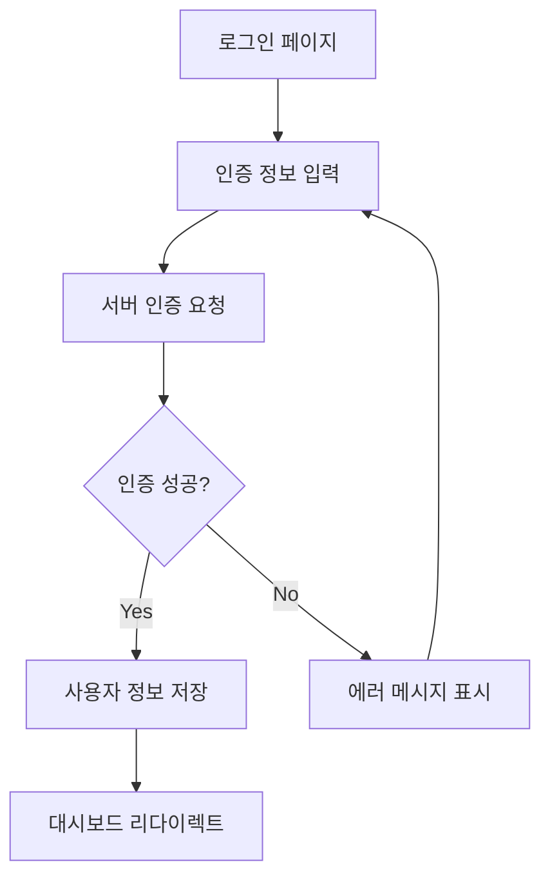
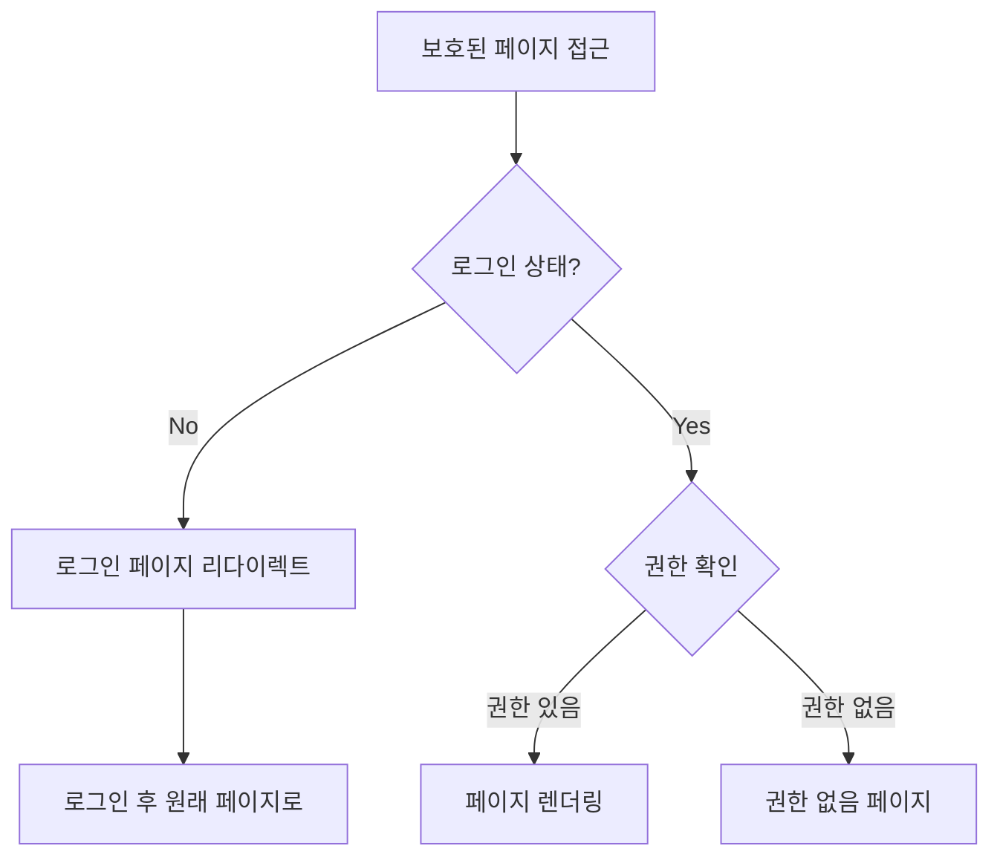

# 🔐 React Router 관리자 대시보드

React 초보자를 위한 React Router v6 고급 기능 실습 프로젝트입니다. 보호된 라우트, 역할 기반 접근 제어(RBAC), 중첩 라우팅을 구현하면서 실제 관리자 시스템에서 사용되는 인증과 권한 관리 패턴을 학습할 수 있습니다.

## 🎯 학습 목표

- **보호된 라우트**: 인증이 필요한 페이지 구현과 자동 리다이렉트
- **역할 기반 접근 제어(RBAC)**: 사용자 권한에 따른 페이지 접근 제한
- **중첩 라우팅**: Layout 컴포넌트와 Outlet을 활용한 구조화된 라우팅
- **인증 시스템**: Context API를 활용한 전역 인증 상태 관리
- **사용자 경험**: 로딩 상태, 에러 처리, 직관적인 네비게이션
- **실무 패턴**: 실제 관리자 시스템에서 사용하는 보안 패턴

## 🚀 실행 방법

### 1. 프로젝트 생성 및 설치
```bash
# Vite로 프로젝트 생성
npm create vite@latest admin-dashboard-practice -- --template react-swc-ts
cd admin-dashboard-practice

# 의존성 설치
npm install

# 필수 패키지 설치
npm install @mui/material @emotion/react @emotion/styled @mui/icons-material react-router-dom
```

### 2. 개발 서버 실행
```bash
npm run dev
```

브라우저에서 `http://localhost:5173`으로 접속하여 결과를 확인할 수 있습니다.

### 3. 기타 명령어
```bash
npm run build    # 프로덕션 빌드
npm run lint     # ESLint 검사
npm run preview  # 빌드 결과 미리보기
```

## 📁 프로젝트 구조

```
admin-dashboard-practice/
├── src/
│   ├── types/
│   │   └── auth.ts                 # 🔤 인증 관련 타입 정의
│   ├── data/
│   │   └── mockUsers.ts            # 👥 모킹 사용자 데이터 및 인증 로직
│   ├── contexts/
│   │   └── AuthContext.tsx         # 🔐 인증 Context 및 Hook (핵심)
│   ├── components/
│   │   ├── ProtectedRoute.tsx      # 🛡️ 보호된 라우트 컴포넌트 (핵심)
│   │   └── DashboardLayout.tsx     # 🏗️ 대시보드 레이아웃 (중첩 라우팅)
│   ├── pages/
│   │   ├── LoginPage.tsx           # 🔑 로그인 페이지
│   │   ├── OverviewPage.tsx        # 📊 대시보드 개요
│   │   ├── UsersPage.tsx           # 👥 사용자 관리 (관리자 전용)
│   │   ├── ProfilePage.tsx         # 👤 프로필 페이지
│   │   └── UnauthorizedPage.tsx    # 🚫 권한 없음 페이지
│   ├── App.tsx                     # 🛣️ 라우터 설정 및 중첩 라우팅 (핵심)
│   ├── main.tsx                    # 🔧 앱 진입점 및 테마 설정
│   └── vite-env.d.ts              # 📋 Vite 타입 정의
├── package.json                    # 📦 프로젝트 설정 및 의존성
├── tsconfig.json                   # ⚙️ TypeScript 설정
├── vite.config.ts                  # ⚡ Vite 빌드 도구 설정
├── eslint.config.js                # 📏 코드 품질 검사 설정
└── index.html                      # 🌐 HTML 진입점
```

## 🛣️ 라우트 구조 (요구사항 완벽 구현)

### 📊 구현된 라우트들
```typescript
// 공개 라우트
/login (로그인 페이지)
/unauthorized (권한 없음 페이지)

// 보호된 라우트 (인증 필요)
/dashboard (대시보드 레이아웃)
  ├── /dashboard/overview (대시보드 개요)
  ├── /dashboard/users (사용자 관리 - 관리자 전용)
  └── /dashboard/profile (프로필 페이지)

// 자동 리다이렉트
/ → /dashboard/overview (루트 접근시)
```

### 🔧 라우터 설정 (`src/App.tsx`)
```typescript
const App: React.FC = () => {
  return (
    <AuthProvider>
      <Router>
        <Routes>
          {/* 공개 라우트 */}
          <Route path="/login" element={<LoginPage />} />
          <Route path="/unauthorized" element={<UnauthorizedPage />} />
          
          {/* 보호된 대시보드 라우트 (중첩 라우팅) */}
          <Route
            path="/dashboard"
            element={
              <ProtectedRoute>
                <DashboardLayout />
              </ProtectedRoute>
            }
          >
            {/* 중첩된 라우트들 */}
            <Route path="overview" element={<OverviewPage />} />
            
            {/* 관리자 전용 라우트 */}
            <Route
              path="users"
              element={
                <ProtectedRoute requiredRole="admin">
                  <UsersPage />
                </ProtectedRoute>
              }
            />
            
            <Route path="profile" element={<ProfilePage />} />
          </Route>

          {/* 루트 경로 리다이렉트 */}
          <Route path="/" element={<Navigate to="/dashboard/overview" replace />} />
        </Routes>
      </Router>
    </AuthProvider>
  );
};
```

## 🔧 핵심 구현 사항

### 1. 인증 시스템 (`src/contexts/AuthContext.tsx`)

#### 🔐 AuthContext 구조
```typescript
interface AuthContextType {
  user: User | null;                    // 현재 사용자 정보
  isAuthenticated: boolean;             // 인증 상태
  isLoading: boolean;                   // 로딩 상태
  login: (credentials: LoginRequest) => Promise<boolean>;  // 로그인 함수
  logout: () => void;                   // 로그아웃 함수
}
```

#### 🎛️ 핵심 기능들
```typescript
export const AuthProvider: React.FC = ({ children }) => {
  const [user, setUser] = useState<User | null>(null);
  const [isLoading, setIsLoading] = useState(true);

  // 컴포넌트 마운트시 저장된 인증 정보 복원
  useEffect(() => {
    const savedAuth = localStorage.getItem('dashboard-auth');
    if (savedAuth) {
      setUser(JSON.parse(savedAuth));
    }
    setIsLoading(false);
  }, []);

  // 로그인 처리
  const login = async (credentials: LoginRequest): Promise<boolean> => {
    const authenticatedUser = await authenticateUser(credentials);
    if (authenticatedUser) {
      setUser(authenticatedUser);
      localStorage.setItem('dashboard-auth', JSON.stringify(authenticatedUser));
      return true;
    }
    return false;
  };

  // 로그아웃 처리
  const logout = () => {
    setUser(null);
    localStorage.removeItem('dashboard-auth');
  };
};
```

### 2. 보호된 라우트 시스템 (`src/components/ProtectedRoute.tsx`)

#### 🛡️ ProtectedRoute 컴포넌트
```typescript
const ProtectedRoute: React.FC<ProtectedRouteProps> = ({ 
  children, 
  requiredRole 
}) => {
  const { user, isAuthenticated, isLoading } = useAuth();
  const location = useLocation();

  // 로딩 중일 때
  if (isLoading) {
    return <LoadingScreen />;
  }

  // 인증되지 않은 경우
  if (!isAuthenticated || !user) {
    return <Navigate to="/login" state={{ from: location.pathname }} replace />;
  }

  // 역할 기반 접근 제어
  if (requiredRole && user.role !== requiredRole) {
    return <Navigate to="/unauthorized" replace />;
  }

  return <>{children}</>;
};
```

#### 🔒 접근 제어 레벨
1. **인증 확인**: 로그인 여부 검사
2. **역할 확인**: 필요한 권한 레벨 검사
3. **자동 리다이렉트**: 조건 미충족시 적절한 페이지로 이동

### 3. 중첩 라우팅과 레이아웃 (`src/components/DashboardLayout.tsx`)

#### 🏗️ 대시보드 레이아웃 구조
```typescript
const DashboardLayout: React.FC = () => {
  const { user } = useAuth();
  
  // 역할별 메뉴 필터링
  const menuItems = [
    { text: '대시보드', path: '/dashboard/overview', icon: <DashboardIcon /> },
    { text: '사용자 관리', path: '/dashboard/users', icon: <PeopleIcon />, requiredRole: 'admin' },
    { text: '프로필', path: '/dashboard/profile', icon: <PersonIcon /> },
  ];

  const filteredMenuItems = menuItems.filter(item => 
    !item.requiredRole || user?.role === item.requiredRole
  );

  return (
    <Box sx={{ display: 'flex' }}>
      <AppBar>...</AppBar>
      <Drawer>
        {/* 역할별 필터링된 메뉴 */}
        {filteredMenuItems.map(item => <MenuItem key={item.text} />)}
      </Drawer>
      <Box component="main">
        {/* 중첩된 라우트가 렌더링되는 곳 */}
        <Outlet />
      </Box>
    </Box>
  );
};
```

### 4. 역할 기반 접근 제어 (RBAC)

#### 👥 사용자 역할 시스템
```typescript
export type UserRole = 'admin' | 'user';

interface User {
  id: string;
  email: string;
  name: string;
  role: UserRole;        // 사용자 역할
  avatar?: string;
  createdAt: string;
  lastLoginAt?: string;
}
```

#### 🔐 권한별 접근 매트릭스

| 페이지/기능 | 관리자 (admin) | 일반사용자 (user) | 미인증 사용자 |
|-------------|----------------|-------------------|---------------|
| 로그인 페이지 | ✅ 접근 가능 | ✅ 접근 가능 | ✅ 접근 가능 |
| 대시보드 개요 | ✅ 접근 가능 | ✅ 접근 가능 | ❌ 로그인 필요 |
| 사용자 관리 | ✅ 접근 가능 | ❌ 권한 없음 | ❌ 로그인 필요 |
| 프로필 페이지 | ✅ 접근 가능 | ✅ 접근 가능 | ❌ 로그인 필요 |

## 💡 고급 학습 포인트

### 🔄 인증 플로우

#### 1. 로그인 프로세스


#### 2. 보호된 라우트 접근 플로우


### 🛠️ React Router v6 고급 패턴

#### 1. 중첩 라우팅 구조
```typescript
// 부모 라우트: Layout 컴포넌트
<Route path="/dashboard" element={<DashboardLayout />}>
  {/* 자식 라우트들 */}
  <Route path="overview" element={<OverviewPage />} />
  <Route path="users" element={<UsersPage />} />
  <Route path="profile" element={<ProfilePage />} />
</Route>

// Layout 컴포넌트에서 Outlet 사용
const DashboardLayout = () => (
  <div>
    <Header />
    <Sidebar />
    <main>
      <Outlet /> {/* 자식 라우트가 여기에 렌더링 */}
    </main>
  </div>
);
```

#### 2. 상태 기반 리다이렉트
```typescript
const ProtectedRoute = ({ children }) => {
  const location = useLocation();
  
  if (!isAuthenticated) {
    // 현재 위치를 state로 전달하여 로그인 후 원래 페이지로 돌아가기
    return <Navigate to="/login" state={{ from: location.pathname }} replace />;
  }
  
  return children;
};

// 로그인 성공 후 원래 페이지로 이동
const LoginPage = () => {
  const location = useLocation();
  const from = location.state?.from || '/dashboard/overview';
  
  const handleLoginSuccess = () => {
    navigate(from, { replace: true });
  };
};
```

### 🎨 사용자 경험(UX) 최적화

#### 1. 로딩 상태 처리
```typescript
const ProtectedRoute = ({ children }) => {
  const { isLoading, isAuthenticated } = useAuth();

  if (isLoading) {
    return (
      <Box sx={{ display: 'flex', justifyContent: 'center', py: 8 }}>
        <CircularProgress />
        <Typography>인증 정보를 확인하고 있습니다...</Typography>
      </Box>
    );
  }
  
  // 인증 로직...
};
```

#### 2. 역할별 UI 조건부 렌더링
```typescript
const DashboardLayout = () => {
  const { user } = useAuth();
  
  return (
    <div>
      <Sidebar>
        <MenuItem to="/dashboard/overview">대시보드</MenuItem>
        <MenuItem to="/dashboard/profile">프로필</MenuItem>
        
        {/* 관리자만 보이는 메뉴 */}
        {user?.role === 'admin' && (
          <MenuItem to="/dashboard/users">사용자 관리</MenuItem>
        )}
      </Sidebar>
    </div>
  );
};
```

## 🎨 실행 결과

프로젝트를 실행하면 다음과 같은 완전한 관리자 대시보드를 확인할 수 있습니다:

### 📱 주요 기능들
- **로그인 시스템**: 이메일/비밀번호 기반 인증
- **역할별 대시보드**: 관리자와 일반사용자 구분된 인터페이스
- **보안 라우팅**: 인증 및 권한 기반 페이지 접근 제어
- **반응형 레이아웃**: 모바일부터 데스크톱까지 최적화
- **상태 영속성**: localStorage를 통한 로그인 상태 유지

### 🔐 데모 계정

| 이메일 | 비밀번호 | 역할 | 접근 가능한 메뉴 |
|--------|----------|------|------------------|
| admin@example.com | admin123 | 👨‍💼 관리자 | 대시보드, 사용자 관리, 프로필 |
| user@example.com | user123 | 👤 일반사용자 | 대시보드, 프로필 |

### 🎯 테스트 시나리오
1. **관리자 로그인**: 모든 메뉴 접근 가능
2. **일반사용자 로그인**: 사용자 관리 메뉴 접근시 권한 없음 페이지로 이동
3. **로그아웃 후 보호된 페이지 접근**: 자동으로 로그인 페이지로 리다이렉트
4. **새로고침**: 로그인 상태 유지 (localStorage)

## 🔄 확장 가능한 기능들

이 프로젝트를 기반으로 다음과 같은 고급 기능들을 추가로 구현해볼 수 있습니다:

### 🔒 보안 강화
- [ ] **JWT 토큰**: 토큰 기반 인증 시스템
- [ ] **토큰 갱신**: Access Token과 Refresh Token 패턴
- [ ] **세션 타임아웃**: 비활성 시간에 따른 자동 로그아웃
- [ ] **2단계 인증**: OTP, SMS 인증 추가
- [ ] **비밀번호 정책**: 강력한 비밀번호 요구사항

### 👥 사용자 관리 고도화
- [ ] **사용자 CRUD**: 관리자의 사용자 생성/수정/삭제
- [ ] **권한 그룹**: 세분화된 권한 시스템
- [ ] **사용자 활동 로그**: 로그인, 액션 기록
- [ ] **계정 잠금**: 실패 시도에 따른 계정 잠금
- [ ] **대량 사용자 관리**: CSV 업로드, 일괄 처리

### 🎨 사용자 경험 향상
- [ ] **다크 모드**: 테마 전환 기능
- [ ] **다국어 지원**: i18n 통합
- [ ] **브레드크럼**: 복잡한 중첩 라우트용 네비게이션
- [ ] **검색 기능**: 전역 검색과 필터링
- [ ] **실시간 알림**: WebSocket 기반 푸시 알림

### 📊 대시보드 기능
- [ ] **실시간 차트**: Chart.js 또는 D3.js 통합
- [ ] **데이터 테이블**: 정렬, 필터링, 페이지네이션
- [ ] **위젯 시스템**: 드래그 앤 드롭 대시보드
- [ ] **리포트 생성**: PDF, Excel 내보내기
- [ ] **설정 관리**: 시스템 설정 페이지

## 🔧 문제 해결 가이드

### 자주 발생하는 이슈들

1. **무한 리다이렉트 루프**
   ```typescript
   // ❌ 잘못된 방법
   useEffect(() => {
     if (!isAuthenticated) {
       navigate('/login');
     }
   }); // 의존성 배열 누락으로 무한 루프
   
   // ✅ 올바른 방법
   useEffect(() => {
     if (!isAuthenticated) {
       navigate('/login');
     }
   }, [isAuthenticated, navigate]);
   ```

2. **인증 상태가 초기화되는 문제**
   ```typescript
   // AuthProvider에서 localStorage 체크를 useEffect로 처리
   useEffect(() => {
     const initializeAuth = () => {
       const savedAuth = localStorage.getItem('dashboard-auth');
       if (savedAuth) {
         setUser(JSON.parse(savedAuth));
       }
       setIsLoading(false); // 초기화 완료 표시
     };
     
     initializeAuth();
   }, []);
   ```

3. **역할 기반 라우트가 작동하지 않는 문제**
   ```typescript
   // ProtectedRoute에서 role 체크 시 정확한 비교
   if (requiredRole && user?.role !== requiredRole) {
     return <Navigate to="/unauthorized" replace />;
   }
   ```

4. **중첩 라우트에서 404 발생**
   ```typescript
   // 부모 라우트에서 index route 설정
   <Route path="/dashboard" element={<DashboardLayout />}>
     <Route index element={<Navigate to="overview" replace />} />
     <Route path="overview" element={<OverviewPage />} />
   </Route>
   ```

## 📚 참고 자료

### 📖 공식 문서
- [React Router v6 공식 문서](https://reactrouter.com/) - 라우팅 전반
- [React Context API](https://ko.react.dev/reference/react/createContext) - 상태 관리
- [Material-UI Layout](https://mui.com/material-ui/react-drawer/) - UI 컴포넌트

### 🔒 보안 및 인증
- [JWT.io](https://jwt.io/) - JSON Web Token 가이드
- [OWASP Authentication Guide](https://owasp.org/www-project-cheat-sheets/cheatsheets/Authentication_Cheat_Sheet.html) - 인증 보안
- [Role-Based Access Control](https://en.wikipedia.org/wiki/Role-based_access_control) - RBAC 개념

### 🎨 UX 패턴
- [Admin Dashboard UX Patterns](https://admindesigns.com/) - 관리자 UI 패턴
- [Material Design Navigation](https://m3.material.io/components/navigation-drawer) - 네비게이션 가이드

## 🤝 기여하기

이 프로젝트는 교육 목적으로 만들어졌습니다. 다음과 같은 기여를 환영합니다:

- 🐛 **버그 리포트**: 인증 이슈나 라우팅 문제 보고
- 📖 **문서 개선**: README나 코드 주석 향상
- ✨ **기능 추가**: 새로운 보안 기능이나 UX 개선
- 🧪 **테스트 코드**: 인증 로직 테스트 추가
- 🎨 **UI/UX 개선**: 더 나은 관리자 인터페이스 제안

## 📄 라이선스

이 프로젝트는 MIT 라이선스를 따릅니다.

---

**Happy Coding! 🔐**

*React Router와 보안 패턴을 마스터하여 안전하고 사용자 친화적인 관리자 시스템을 만들어보세요!*

## 💭 학습 후 다음 단계

이 프로젝트를 완료한 후에는 다음과 같은 고급 주제들을 학습해보세요:

### 🚀 실무 레벨 인증 시스템
1. **서버 사이드 인증**: Node.js + JWT 또는 Firebase Auth
2. **소셜 로그인**: Google, GitHub OAuth 통합
3. **마이크로서비스 인증**: 다중 서비스 간 인증 관리
4. **보안 감사**: 인증 로그와 보안 모니터링

### 🔄 고급 라우팅 패턴
1. **동적 라우트 생성**: 사용자 권한에 따른 동적 메뉴
2. **라우트 가드 미들웨어**: 복잡한 권한 체크 로직
3. **라우트 기반 코드 스플리팅**: 권한별 청크 분할
4. **라우트 애니메이션**: 페이지 전환 애니메이션

### 🏗️ 대규모 애플리케이션 아키텍처
1. **모듈 페더레이션**: 마이크로 프론트엔드 아키텍처
2. **상태 관리 스케일링**: Redux Toolkit + RTK Query
3. **테스트 전략**: 인증 플로우 E2E 테스트
4. **CI/CD 파이프라인**: 보안 검사 자동화